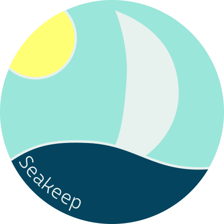

  
  <h1 style="font-style:italic;">Seakeep</h1>
  
Your privacy in your ocean

## Table of Contents

- [Welcome](#welcome-👋)
- [About](#about)
- [Why "*Seakeep*"?](#why-“seakeep”%3F-🤔)
- [Logo Colors](#logo-colors)
- [What products Seakeep offers?](#what-products-seakeep-offers%3F)

## Welcome 👋

Hello, everybody, my name is Gabriel Maturana and I'm a future Web Developer
and Data Scientist, this project is a school exercise to practice my HTML, CSS
and Javascript knowledges.

## About

Seakeep is a **fictitious** company focused on privacy and security, offering
products to keep your users safe to navigate in the web.

The primary objective is to keep your users informations safe, hiding then from
websites and companies that collect daily information data.

Some of the Seakeep **fictitious** products works with end-to-end encryption 🔒, so only
the sender and recipient have access to the content being sent.

## Why "*Seakeep*"? 🤔

For me, the sea brings a peace sensation, a place to stay calm and clean your
mind, a place away from people.

The "*keep*" is self-explanatory 😉.

## Logo Colors

As Seakeep is a company focused on privacy and security, so it's important for
users to feel safe.

- 🔵: Brings a feeling of security
- ⚪: Just to represent the sail of the boat
- 🌞: The sun represents happiness

## What products Seakeep offers?

Seakeep offers product to keep your users save, so offering products like:

- **Seamail**: End-to-end encrypted email
- **Seadrive**: Encrypted cloud storage
- **Sealock**: Encrypted vault to store passwords and logins
- **SeaVPN**: A VPN service

All Seakeep **fictitious** products are open source.

